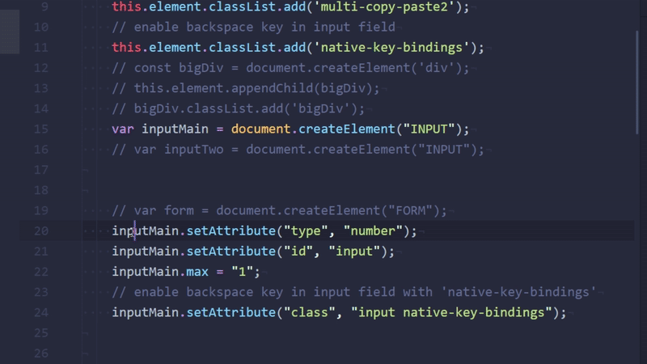
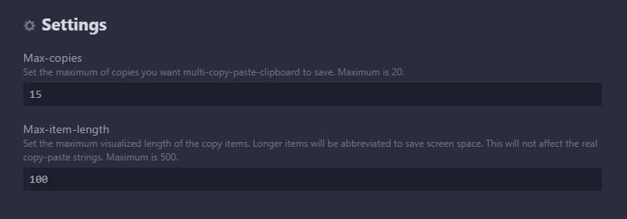

# multi-copy-paste-clipboard package

A package for the `atom` editor to enable a clipboard for multiple copy-paste operations. It provides a list of the last 10 to 20 copies and you select one element from the copy-list for pasting.

# Keybindings
```
  Keystroke     | Command	Selector          | Source
---------------------------------------------------------------------------
  ctrl-alt-y    | multi-copy-paste:toggle   | Toggle your modal window
  ctrl-c        | multi-copy-paste:copy     | Copy
  ctrl-v        | multi-copy-paste:paste    | Auto-paste your last item
  escape, enter | multi-copy-paste:toggle   | Close your modal window without pasting
  0 to 9        | multi-copy-paste:paste    | Paste the corresponding item (0-9)
                |                           | from the buffer and close modal window
  ctrl-0 to 9   | multi-copy-paste:paste    | Paste the corresponding item (10-19)
                |                           | from the buffer and close modal window
```

On MacOS use `cmd` instead of `ctrl`.

# Screenshot



# How to install

- Via the atom package manager (`apm`):
  - `apm install multi-copy-paste-clipboard`
- Or inside the `atom` editor, on the Settings page (Control-,), on the install tab.
- Or from `atom.io` website
  - https://atom.io/packages/multi-copy-paste-clipboard

# Settings
- You can customize the amount of copies you want to manage in your clipboard.
- You can customize the length of the copies displayed in your clipboard.





# Package for `atom` :atom:


# Enjoy

- If you like it or use it, give it a :star: on :octocat: repo [multi-copy-paste-clipboard](https://github.com/Jonny-exe/multi-copy-paste-clipboard) and another :star: on :atom: package [multi-copy-paste-clipboard](https://atom.io/packages/multi-copy-paste-clipboard). Thanks! :heart:
- Improve it? Contribute and send me a PR.
